# How to Bulk Edit Product Prices in Shopify

Changing product prices in Shopify is easy when you only have a few products. But once your store has dozens or hundreds of SKUs, editing prices one by one quickly becomes slow and repetitive.

This is especially true for products with variants. Each size, color, or bundle can have its own price, which means one product may contain many separate price fields to update.

That is why merchants often look for a way to bulk edit product prices in Shopify. Before choosing a solution, it helps to understand what Shopify's native tools can do and where they start to feel limited.

## How to Bulk Edit Product Prices Using Shopify's Native Tools

Shopify's built-in bulk editor lets you update multiple products and variants from the Shopify admin. It works like a spreadsheet, where each row represents a product or variant, and each column represents a product property such as price, SKU, or compare-at price.

To bulk edit prices in Shopify:

1. From your Shopify admin, go to **Products**.

2. Select the products you want to update using the checkboxes.

3. Click **Bulk edit**.

   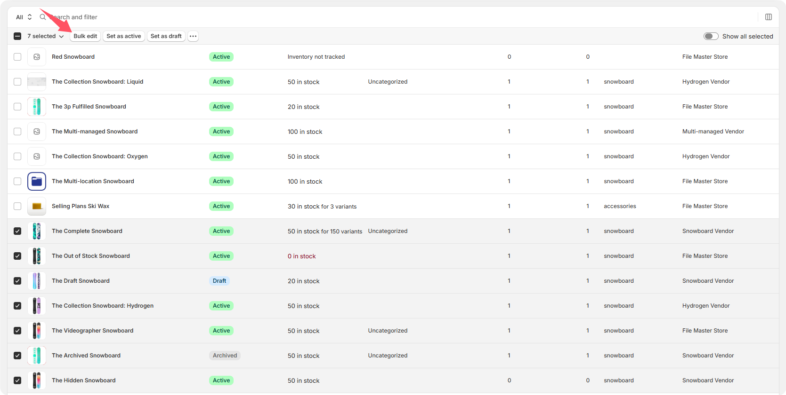

4. In the bulk editor, click **Columns**.

5. Add the pricing fields you want to edit, such as **Price** and **Compare-at price**.

   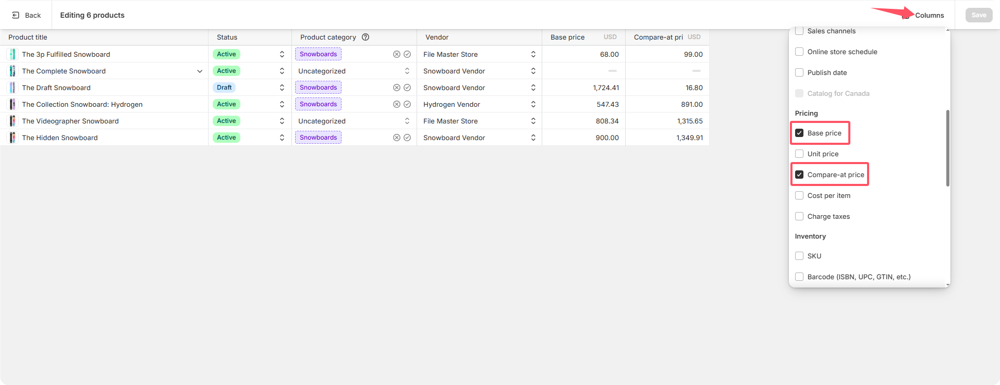

6. Click into the table cells and enter the new prices.

   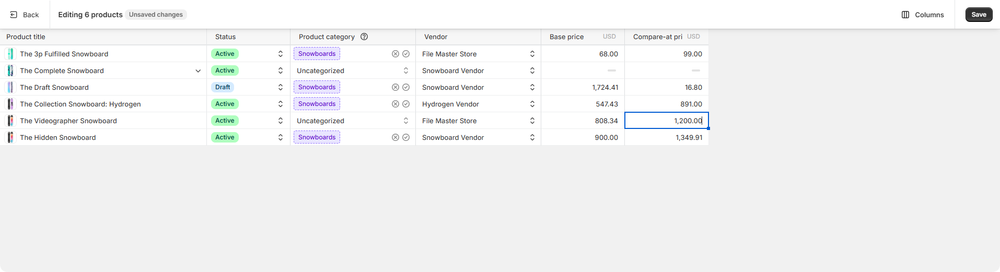

7. Use spreadsheet-style shortcuts, such as selecting multiple cells or dragging a value down, to speed up repetitive edits.

8. Click **Save** when you are done.

   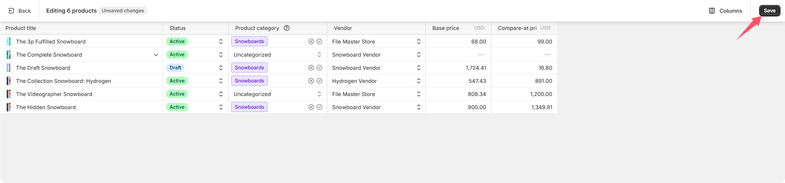

For larger price updates, Shopify also supports product CSV import and export. 

## Limitations of Shopify's Native Bulk Price Editing

Shopify's native bulk editor is useful for simple price updates, but it has several limitations when you need more control over large-scale pricing changes.

1. **It does not support complex bulk pricing rules.**

   If you want to increase prices by a percentage, reduce prices by a fixed amount, round prices to end in `.99`, or apply different rules based on product type, vendor, tag, collection, or variant condition, you need to calculate those changes manually before entering them into Shopify.

2. **It lacks a clear before-and-after comparison before changes are applied.** 

   When editing many products or variants at once, merchants need a reliable overview of what will change, which items will be affected, and whether any prices look unusual. Without a change summary or review step before execution, it is easier to make mistakes, especially during large promotions or catalog-wide price adjustments.

3. **Shopify's native tools do not provide a dedicated price change history.**

   After a bulk price update is saved, it can be difficult to review when prices were changed, which products were affected, and what the previous values were.

4. **Shopify does not support quickly creating a new price update task from a previous change record.**

   If you want to change prices back or reuse the pricing configuration from an earlier update, you need to rebuild the change manually instead of starting from that historical setup.

5. **Shopify's native bulk editor does not separate editing, saving, and submitting into different steps.**

   If you need to update 200 variant prices at 5:00 PM, you generally have to complete the whole edit in one session and then submit the changes. You cannot create a price update form first, edit part of it at 10:00 AM, save it as a draft, continue editing at 2:00 PM, and finally submit the prepared change at 5:00 PM. The native workflow does not provide an intermediate draft state for price change tasks.

6. **Shopify's native bulk editor does not support scheduled price updates.**

   If you want a sale to start or end at a specific time, you need to make the price changes manually at that time or use another workflow.

## A Better Way: Use Bulk Files, Prices, SEO & GEO

If you want more control than Shopify's native bulk editor, you can use the **Pricing Tasks** workflow in **Bulk Files, Prices, SEO & GEO**. The workflow is built around a simple idea: prepare the price update first, review every change, and then decide whether to save it, run it now, or schedule it for later.

### 1. Create a pricing task

Open **Pricing Tasks** and click **Create task**. The task list keeps your price updates organized, so you can see which ones are drafts, scheduled, running, or completed.

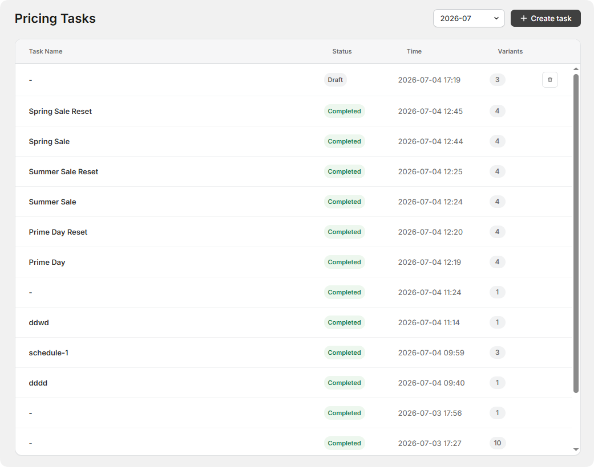

You can also create a new pricing task from a previous task's price configuration. This makes it easy to roll prices back after a campaign or reuse the same pricing setup for another promotion.

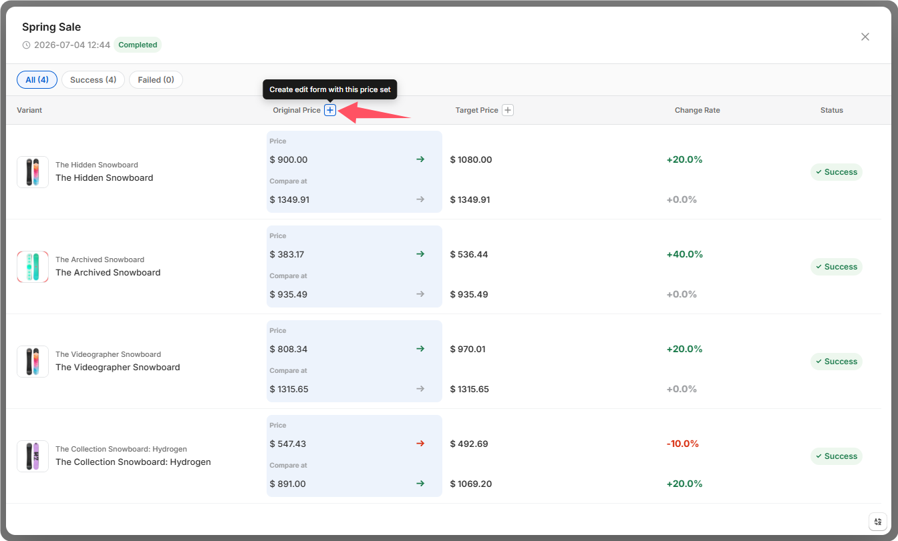

### 2. Add products and edit prices

Add the products or variants you want to update. In the task table, you can compare the original price with the target price and change rate side by side. You can edit the target price directly, or edit the change rate and let the app automatically calculate and update the target price. 

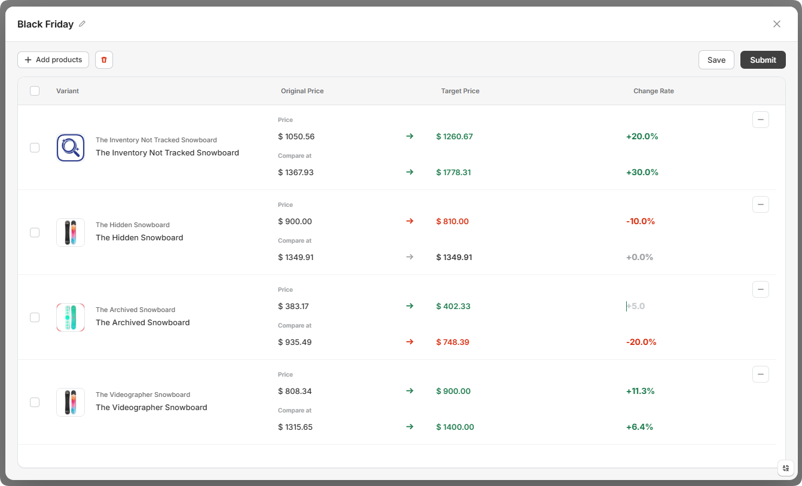

You can also use common bulk editing functions to update selected variants faster.

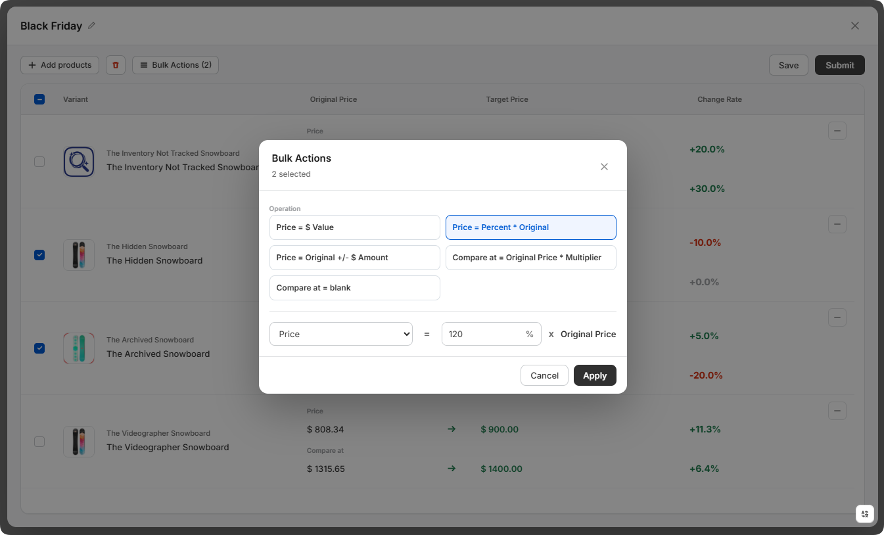

### 3. Save the task as a draft or submit it

Once the price changes are prepared, click **Save** to save the task as a draft. You can come back to it from the Pricing Tasks list later, reopen the task, and continue editing before applying the changes. If the update is already ready to go, you can click **Submit** instead to review and execute the task immediately.

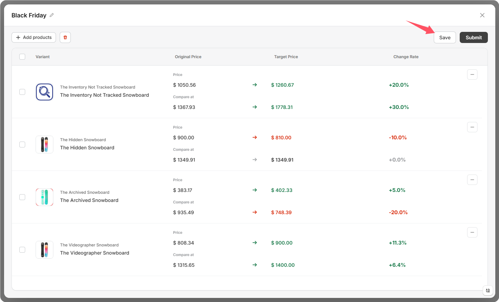

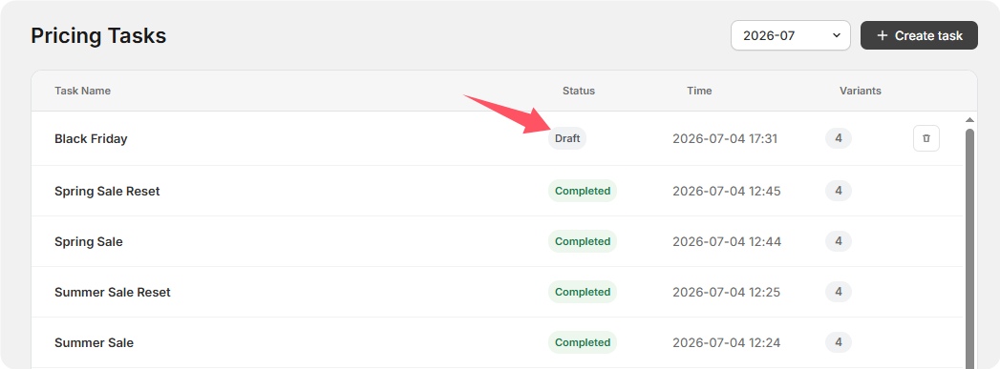

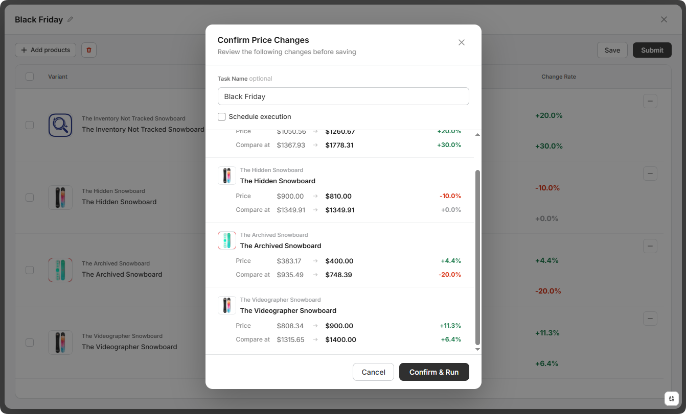

### 4. Schedule the task if it should run later

If the price change should happen at a specific time, click **Submit**, enable scheduled execution in the confirmation step, and choose when the task should run automatically.

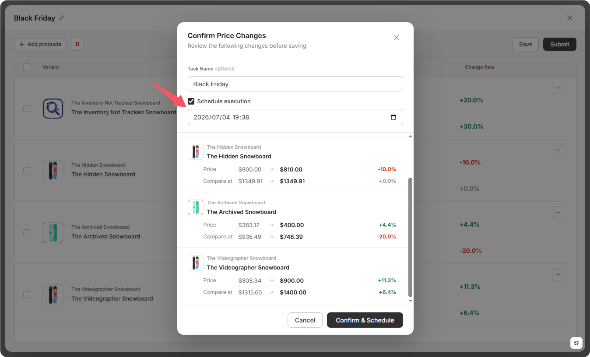

Besides price tasks, **[Bulk Files, Prices, SEO & GEO](https://apps.shopify.com/file-master)** also supports bulk file management, image SEO updates, and automatic LLMS.txt generation and updates, so you can handle several repetitive Shopify tasks in one place.

The Free Plan already covers most of the core features, so if this workflow looks useful, you can try it first. And if you do need more, the paid plan is designed to offer strong value for your store.

